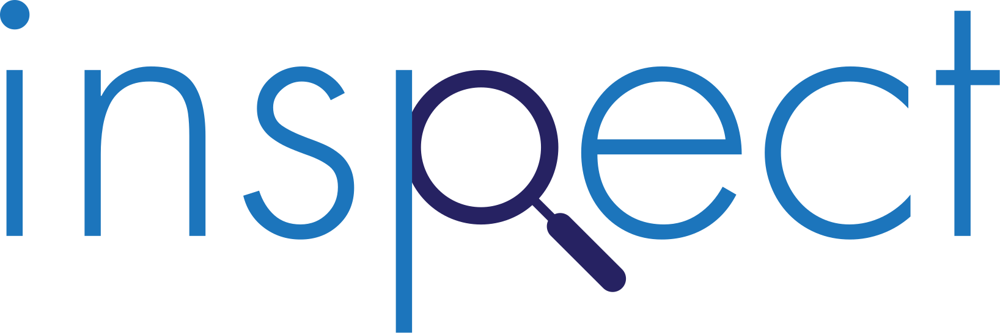
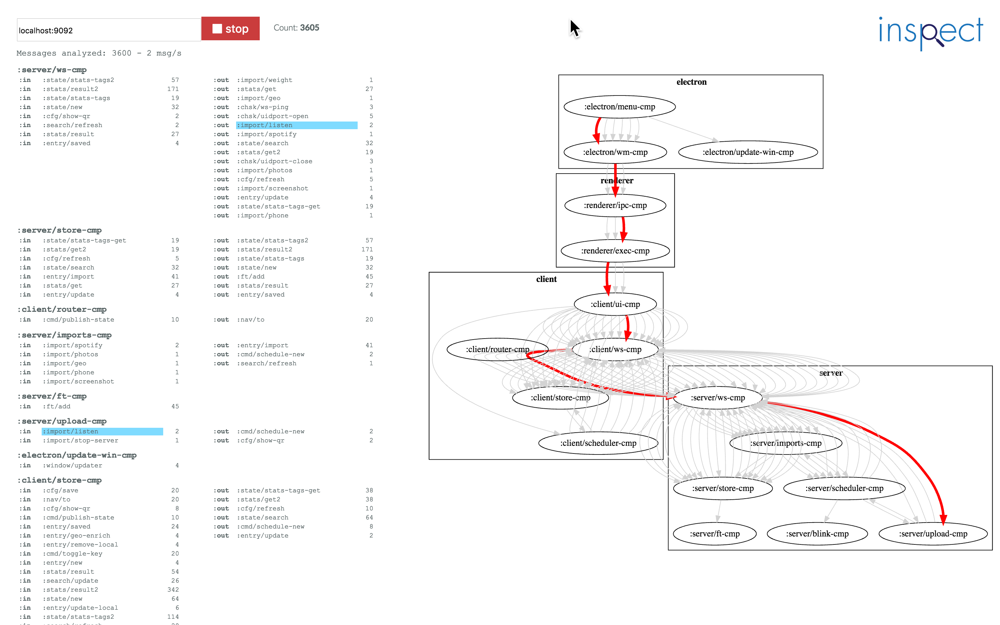

This Electron-based application lets you look inside systems built with the **[systems-toolbox](https://github.com/matthiasn/systems-toolbox)**. You need a system that is configured to offload its firehose to a Kafka topic. Once that is set up, you can connect this application to your Kafka host and watch it draw your system from the messages flowing through. Other than that, this application has zero knowledge about the system under observation. This particular screenshot comes from observing my **[meo](https://github.com/matthiasn/meo)** journaling application, where **inspect** has already helped quite a bit in making sense of message flows.

## Download

If you don't want to build this application yourself, you can download an already packaged application:

* **[Mac](https://s3.eu-central-1.amazonaws.com/matthiasn-inspect/inspect-0.2.63.dmg)**

The Mac version will notify you when there's an update. For Linux, that feature is still missing, unfortunately. If you believe that should be different, maybe you can help out with the [electron-builder](https://github.com/electron-userland/electron-builder/issues/1138) project.

## Preparing your machine

For a fresh Ubuntu 17 VM, you can run the following script:

    $ install_ubuntu.sh

## Building inspect

    $ npm install -g electron-builder
    $ npm install -g electron-publisher-s3
    $ yarn install
    $ lein cljsbuild auto main
    $ lein cljsbuild auto view
    $ lein cljsbuild auto updater
    $ lein sass4clj auto
    $ npm run build
    $ npm start

## Publishing inspect

    $ AWS_ACCESS_KEY_ID=<...> AWS_SECRET_ACCESS_KEY=<...> ./publish.sh -l beta
    $ AWS_ACCESS_KEY_ID=<...> AWS_SECRET_ACCESS_KEY=<...> ./publish.sh -m release

## Contributions

Contributions always welcome. Please help to make this project more useful, prettier, and just generally more awesome. Thanks! 

## License

Copyright © 2016, 2017 Matthias Nehlsen

Distributed under the Eclipse Public License either version 1.0 or (at your option) any later version.
